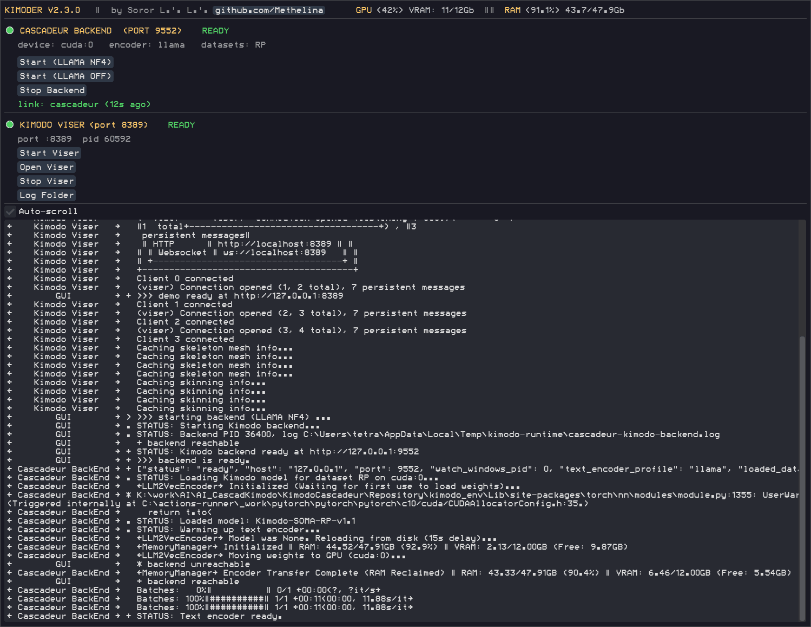

# KimoDer — Kimodo+Cascadeur Portable

One-click portable installer for [Kimodo](https://github.com/NVlabs/kimodo) motion diffusion model with Cascadeur integration. **No Docker, no WSL, no cloud.** Runs entirely from a single folder.

## What is KimoDer?

KimoDer combines two independent technologies into a single portable pipeline:

| Component | What it does |
|-----------|-------------|
| **[Kimodo](https://github.com/NVlabs/kimodo)** | NVIDIA's motion diffusion model. Takes a text description ("a person jumps over an obstacle") and generates a full-body skeleton animation. Runs on a local GPU, no cloud. |
| **Text encoder** | Custom merged 4-bit NF4 encoder: [`Aero-Ex/KIMODO-Meta3_llm2vec_NF4`](https://huggingface.co/Aero-Ex/KIMODO-Meta3_llm2vec_NF4) — **~3× lighter** than the default LLM2Vec build, fits into **8 GB VRAM**. Original default builds used 17–20 GB (LLAMA full) or up to 10 GB (LLAMA 8-bit + CPU offload). |
| **[Cascadeur](https://cascadeur.com/)** | Professional 3D character animation software with physics-assisted posing and a Python scripting API. Industry-standard tool for keyframe animation. **Not included in the package** — you must download it separately. |

### Why combine them?

- **Kimodo alone** produces an FBX file — but you can't see it in context or edit it without leaving the toolchain.
- **Cascadeur alone** is great for manual animation but has no AI motion generation.

With KimoDer, you type a prompt, click "Generate", and the animation appears **directly on the Cascadeur timeline** on a SOMA-77 skeleton — ready to tweak, retarget, or export.

> **Important:** you must first **select a time range between two keyframes** on the Cascadeur timeline — otherwise inference won't start. The script generates motion to fill the selected interval.

### Requirements

- **Cascadeur 2026+** — skeleton compatibility between Kimodo and Cascadeur depends on the SOMA-77 rig introduced in Cascadeur 2024, and full roundtrip support requires 2026+.
- **Paid version** — the free edition of Cascadeur **does not include retargeting**, so the Kimodo Roundtrip script will not work. Pro or Business license required.

### How it's used in projects

| Use case | Flow |
|----------|------|
| **Game prototyping** | Describe an NPC action ("idle, looking around") → select time range on timeline → generate → adjust timing in Cascadeur → export FBX to the engine |
| **Film / VFX previz** | Generate a rough take from text in seconds, then refine with Cascadeur's keyframe tools |
| **Indie animation** | No mocap suit required — type the motion you need, get a physically plausible starting point, polish it manually |
| **Iteration loop** | Generate → edit in Cascadeur → feed back for another diffusion pass (constraint-guided) |

### How the pipeline works

```
Text prompt ——> Kimodo diffusion model ——> skeleton animation
                   ↑                              ↓
              LLAMA text encoder          Cascadeur BackEnd
              (text → embedding)          (HTTP server, port 9552)
                                                  ↓
                                            Cascadeur plugin
                                          (Kimodo Roundtrip)
                                                  ↓
                                       [1] Select timeline range
                                       [2] Click Generate
                                                  ↓
                                    Editable animation in Cascadeur
```

All of this runs inside a single portable folder. No Docker, no WSL, no cloud GPU. The backend uses a local LLAMA-based text encoder (or a lightweight hash fallback for lower VRAM) and the diffusion model runs entirely on your NVIDIA GPU.

## Quick Start

```powershell
# First time — install everything (~12 GB download)
.\Install_KimoDer-UV.ps1 -Install

# Daily use — GUI control panel
.\Run_KimoDer.ps1
```

## GUI Control Panel



Two-section layout with per-service status indicators, plus a live system load bar:

- **Status bar** — `GPU <%> VRAM: X/YGb || RAM <%> X/YGb`, orange GPU/RAM labels, refreshed every 3 s
- **Cascadeur BackEnd** (port 9552) — colored circle indicator (gray=down, yellow=warming, green=ready, blue=busy, red=error), Start/Stop buttons for LLAMA NF4 and LLAMA OFF modes, Cascadeur link display
- **Kimodo Viser** — colored circle indicator (gray=stopped, yellow=loading, green=ready), port shown in the section header while running, Start/Stop Viser, Log Folder, and an **Open Viser** button that unlocks (green text) once Viser is ready and opens the web UI in the browser. Readiness is detected from the `listening` line in the Viser log and verified over HTTP — no false "ready" before the server actually accepts connections (up to 8 min startup timeout)
- **Live log** — console + GUI log area with adaptive word wrap, service tags `[Cascadeur BackEnd]`, `[Kimodo Viser]`, `[GUI]` and type symbols (`!` error, `*` warn, `+` ok, `.` status, `>` action). Log re-wraps dynamically on window resize. **Auto-scroll** checkbox toggles following new lines
- **Tooltips** — every button explains itself on hover
- **Process discipline** — closing the GUI triggers a graceful shutdown: stops demo, stops backend, sweeps all zombie Python processes from the venv

## CLI Reference

```powershell
.\Install_KimoDer-UV.ps1 -Install              # Non-interactive full install
.\Install_KimoDer-UV.ps1 -Reinstall            # Wipe & reinstall
.\Run_KimoDer.ps1 -StartBackend llama          # Start backend (LLAMA NF4)
.\Run_KimoDer.ps1 -StartBackend fallback       # Start backend (LLAMA OFF)
.\Run_KimoDer.ps1 -StopBackend                 # Stop backend
.\Run_KimoDer.ps1 -CheckBackend                # Health check (JSON output)
.\Run_KimoDer.ps1 -StartDemo                   # Launch web demo
.\Run_KimoDer.ps1 -InstallCascadeurCommand -CascadeurRoot "path"

# Direct backend control:
.\kimodo_env\Scripts\python.exe scripts\backend_ctl.py start --profile llama --watch
.\kimodo_env\Scripts\python.exe scripts\backend_ctl.py start-demo --watch
.\kimodo_env\Scripts\python.exe scripts\backend_ctl.py health --json
.\kimodo_env\Scripts\python.exe scripts\backend_ctl.py stop
```

## Requirements

- Windows 10/11, PowerShell 5.1+
- NVIDIA GPU with 8+ GB VRAM (RTX 3060+)
- Git
- [Cascadeur](https://cascadeur.com/) (optional, for animation roundtrip)

## Cascadeur Integration

1. Install Cascadeur separately
2. After environment install, the installer **offers to install the Cascadeur Command right away** (Y/n) — accept, or defer and run it later via installer menu item 3 (`Install Cascadeur Command`)
3. Launch the GUI (`.\Run_KimoDer.ps1`) and press **Start (LLAMA NF4)**
4. In Cascadeur: **Animation Scripts → Kimodo Roundtrip**


**Video walkthrough** (click to play on YouTube):

[](https://youtu.be/Q4Bp6asB6Bw)

If you move the Repository folder, rerun `scripts\install_cascadeur_command.ps1` to update paths.

## Model Stack

- **Diffusion:** `nvidia/Kimodo-SOMA-RP-v1` (SOMA-77, Retargeting Preset), SEED variant available via dataset selector
- **Text encoder:** `Aero-Ex/KIMODO-Meta3_llm2vec_NF4` (merged 4-bit NF4) — in-process with memory manager offload; optional `HashTextEncoder` fallback (LLAMA OFF mode, ~0 VRAM)
- **Skeleton:** SOMA-77 (Cascadeur SOMA rig)
- Custom checkpoints supported via `CHECKPOINT_DIR` environment variable

## Structure

```
Repository/
├── Install_KimoDer-UV.ps1       # AIO installer (env + models + hybrid)
├── Run_KimoDer.ps1              # GUI launcher / runtime CLI
├── _hf_pycurl_download.py       # HF model downloader (pycurl)
├── _llm2vec_wrapper_template.py
├── bin/uv.exe, bin/uvx.exe      # uv package manager
│   └── res/                     # ModeSeven fonts
├── integrations/cascadeur/      # Cascadeur plugin files
├── kimodo_addons/               # Merged into kimodo/ during install
├── scripts/
│   ├── kimoder_gui.py           # DearPyGui control panel
│   ├── backend_ctl.py           # Backend + demo lifecycle (CLI + module)
│   ├── install_cascadeur_command.ps1  # copies plugin into Cascadeur
│   └── cascadeur_backend_service.py   # HTTP backend (port 9552)
└── tools/io_scene_fbx/          # Blender FBX addon modules (Python-only)
```

## Credits

- Kimodo: [NVIDIA Research](https://research.nvidia.com/labs/sil/projects/kimodo/)
- Portable launcher/GUI/RnD with Cascadeur integration: [Soror L.'.L.'.](https://github.com/Methelina/KimoDer_portable)
- Inspired by Anoxxy's scripts and his WSL/Linux/Ubuntu hybrid: [video](https://youtu.be/yu2X-zS840A)
